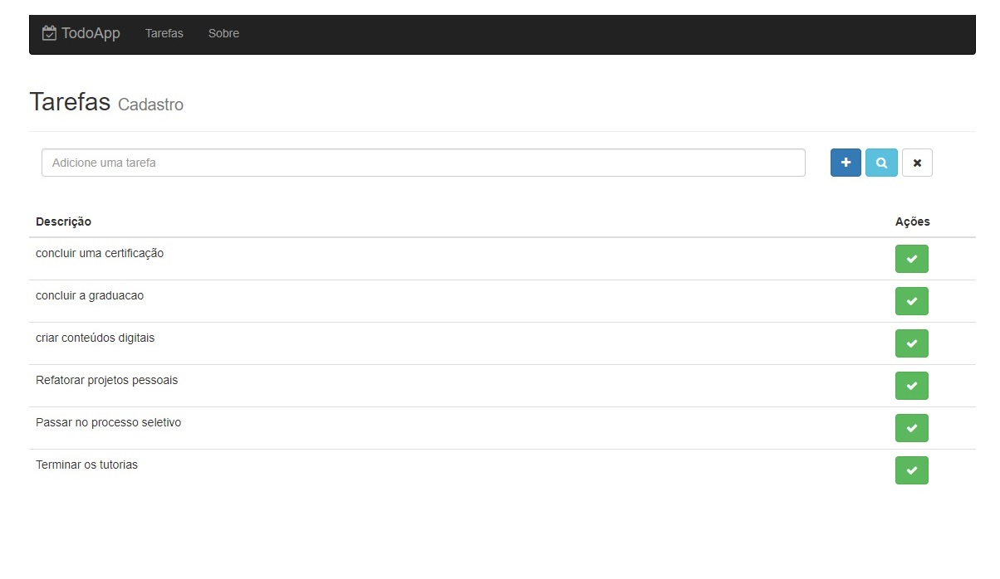

<h4 align="center"> 
	🚧 Todo App 🚀
</h4>   

 
    

 

## 🚀 projeto

Uma aplicação de todo com um crud detalhado e a prática do redux.

## 💻 Tecnologias

- [x] 0. Html, css, javascript
- [x] 1. Express, MongoDB, API Rest, Post Man, Cors, PM2
- [x] 2. ReactJs, Redux, React-Router

## 🎨 Layout

 
    

 

## 🚀 Desafios 

- [x] Construindo o backend com Express [123 - 132] 
- [x] Construindo o frontend com React [133 - 153]  
- [x] Gerenciamento de estado com Redux [154 - 172] 
- [x] Migrando para Redux [173 - 188] 

## 🚀 Inicializar o projeto 

#### Banco de Dados

Subir o cluster do mongo db atlas

#### Backend

Commands `mkdir backend`. Create file `package.json` with details. 
Install the lib in the development mode: `npm i`. 
Option 1 of Project started nodemon : `mongod` and `npm run dev`. 
Option 2 of Project started pm2 : `mongod` and `npm run production`. 
Port 3003 

#### Frontend Web

Commands `mkdir frontend`. Create file `package.json` with details. 
Install the lib in the development mode: `npm i`. 
Project started nodemon : `npm run dev`. 
Port 8080 

## 🚀 Construído projeto 

- [x] 1. Configurar o servidor com express
- [x] 2. Configurar o mongoDB
- [x] 3. Criar requisições com o Postman
- [x] 4. Configurar o Cors
- [x] 5. Rodar o backend com pm2

## 📝 Licença

Este projeto esta sobe a licença MIT.

Feito com ❤️ por Douglas A B Novato 👋🏽 [Entre em contato!](https://www.linkedin.com/in/douglasabnovato/)
 
Fonte do projeto Por Leonardo Moura Leitão no [Curso React + Redux: Fundamentos e 2 Apps do Absoluto ZERO!](https://www.udemy.com/course/react-redux-pt/), [Cod3r](https://www.cod3r.com.br/), [Github Cod3r](https://github.com/cod3rcursos/curso-react-redux)

